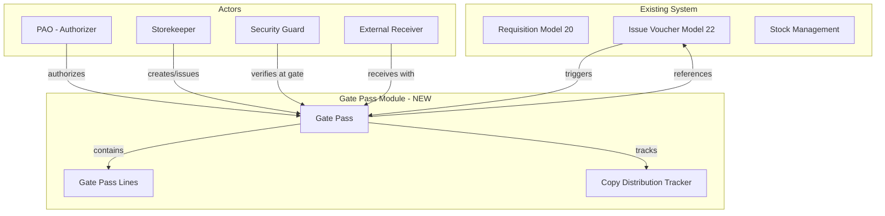
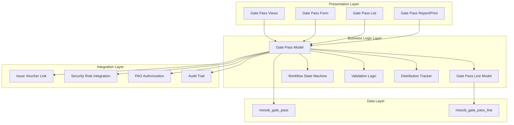
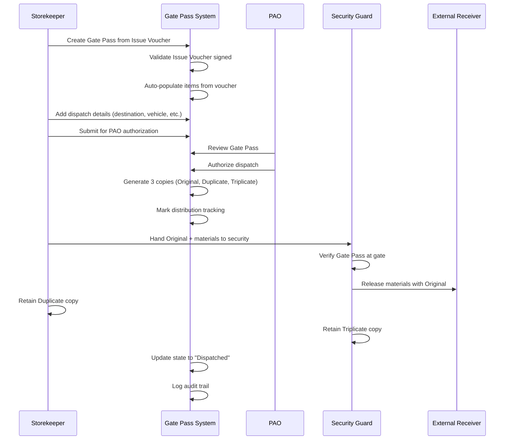
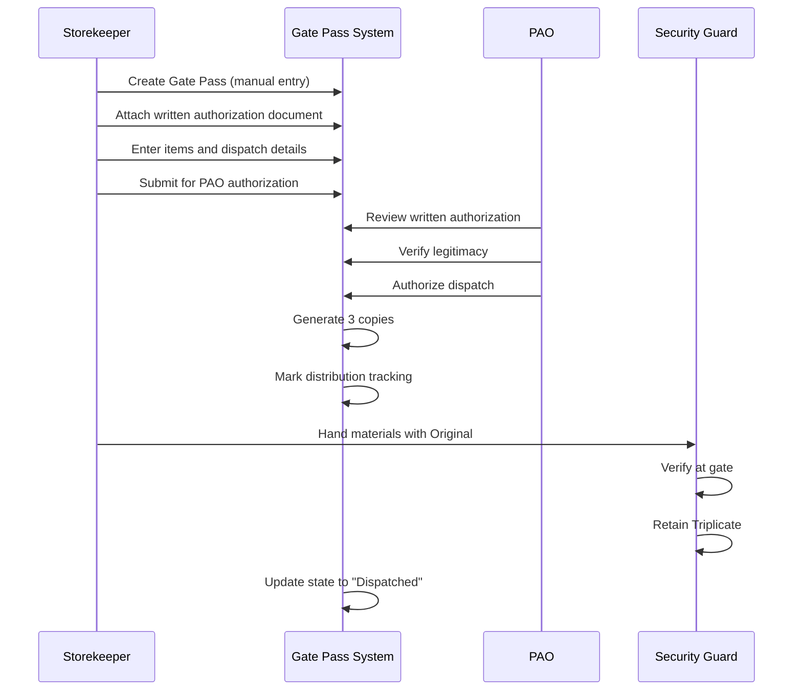
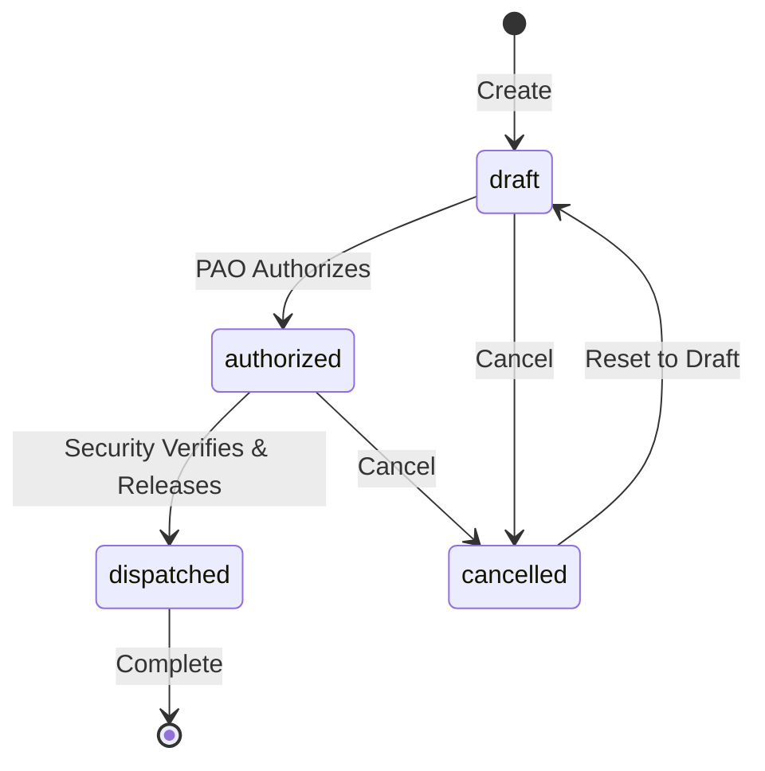

# Design Document: Gate Pass & Dispatch Control

## Overview

The Gate Pass & Dispatch Control module implements FDRE-compliant material dispatch authorization for the Mesob Inventory Management System. This module enforces PAO (Property Administration Officer) written authority requirements for any materials leaving the compound, integrates with the existing Issue Voucher (Model 22) workflow, and implements three-copy distribution tracking for security control. The Gate Pass serves as the sole written authority for material movement outside the organization, ensuring proper custody chain and preventing unauthorized removal of government property.

## Architecture

### System Context



### Component Architecture




### Sequence Diagrams

#### Main Flow: Gate Pass Creation and Dispatch




#### Alternative Flow: Direct Authorization (No Issue Voucher)



## Components and Interfaces

### Component 1: Gate Pass Model (mesob.gate.pass)

**Purpose**: Core model representing the Gate Pass document that authorizes material dispatch outside the compound.

**Interface**:
```python
class MesobGatePass(models.Model):
    _name = "mesob.gate.pass"
    _description = "Gate Pass for Material Dispatch"
    _inherit = ["mail.thread", "mail.activity.mixin"]
    _order = "dispatch_date desc, id desc"
    
    # Core fields
    name: Char  # Auto-generated sequence
    state: Selection  # draft, authorized, dispatched, cancelled
    dispatch_date: Date
    
    # Authorization
    issue_voucher_id: Many2one  # Optional link to Model 22
    written_authorization: Text  # Alternative authorization reference
    authorized_by_id: Many2one  # PAO who authorized
    authorized_on: Datetime
    
    # Dispatch details
    destination: Char
    receiver_name: Char
    receiver_organization: Char
    vehicle_plate: Char
    driver_name: Char
    driver_license: Char
    
    # Copy distribution tracking
    original_to_receiver: Boolean
    duplicate_to_storekeeper: Boolean
    triplicate_to_security: Boolean
    
    # Relations
    line_ids: One2many
    created_by_id: Many2one
    security_verified_by_id: Many2one
    security_verified_on: Datetime
```


**Responsibilities**:
- Enforce PAO authorization requirement before dispatch
- Validate prerequisite documents (Issue Voucher or written authorization)
- Track three-copy distribution workflow
- Maintain immutable audit trail after dispatch
- Integrate with security role for gate verification
- Generate printable Gate Pass document

### Component 2: Gate Pass Line Model (mesob.gate.pass.line)

**Purpose**: Individual line items on a Gate Pass, representing materials being dispatched.

**Interface**:
```python
class MesobGatePassLine(models.Model):
    _name = "mesob.gate.pass.line"
    _description = "Gate Pass Line Item"
    
    gate_pass_id: Many2one  # Parent Gate Pass
    item_id: Many2one  # Link to mesob.inventory.item
    description: Char  # Item description
    quantity: Float
    uom_id: Many2one  # Unit of measure
    serial_numbers: Text  # For serialized items
    remarks: Char
```

**Responsibilities**:
- Store item details for dispatch
- Support auto-population from Issue Voucher lines
- Allow manual entry for direct authorization cases
- Track serial numbers for controlled items

### Component 3: State Machine Workflow

**Purpose**: Manage Gate Pass lifecycle states and enforce business rules.

**State Definitions**:
```python
STATE_SELECTION = [
    ("draft", "Draft"),
    ("authorized", "Authorized by PAO"),
    ("dispatched", "Dispatched"),
    ("cancelled", "Cancelled"),
]
```

**State Transitions**:



**State Transition Rules**:
- **draft → authorized**: Requires PAO role, validates prerequisite documents
- **authorized → dispatched**: Requires security guard role, marks copy distribution
- **Any → cancelled**: Allowed only before dispatch, requires reason
- **cancelled → draft**: Allows correction and resubmission

## Data Models

### Model 1: mesob.gate.pass

```python
{
    "name": "GP/2026/0001",  # Sequence format: GP/YYYY/####
    "state": "authorized",
    "dispatch_date": "2026-03-15",
    "issue_voucher_id": 42,  # FK to mesob.inventory.issue.voucher
    "written_authorization": None,  # Alternative to issue_voucher_id
    "authorized_by_id": 5,  # FK to res.users (PAO)
    "authorized_on": "2026-03-15 10:30:00",
    "destination": "Ministry of Health - Addis Ababa Branch",
    "receiver_name": "Ato Kebede Alemu",
    "receiver_organization": "Ministry of Health",
    "vehicle_plate": "AA-3-12345",
    "driver_name": "Ato Tesfaye Bekele",
    "driver_license": "DL-AA-987654",
    "original_to_receiver": True,
    "duplicate_to_storekeeper": True,
    "triplicate_to_security": True,
    "created_by_id": 3,  # FK to res.users (Storekeeper)
    "security_verified_by_id": 8,  # FK to res.users (Security Guard)
    "security_verified_on": "2026-03-15 14:15:00",
    "line_ids": [1, 2, 3],  # FK to mesob.gate.pass.line
    "note": "Urgent delivery for emergency medical supplies"
}
```

**Validation Rules**:
- `name` must be unique and auto-generated
- Either `issue_voucher_id` OR `written_authorization` must be provided (not both)
- `authorized_by_id` must be a user in PAO group
- `security_verified_by_id` must be a user in Security Guard group
- `dispatch_date` cannot be in the future
- `line_ids` must contain at least one line
- State transitions must follow state machine rules


### Model 2: mesob.gate.pass.line

```python
{
    "gate_pass_id": 15,  # FK to mesob.gate.pass
    "item_id": 234,  # FK to mesob.inventory.item
    "description": "Medical Surgical Gloves - Latex Free",
    "quantity": 50.0,
    "uom_id": 12,  # FK to uom.uom (boxes)
    "serial_numbers": "SN-2026-001 to SN-2026-050",
    "remarks": "Sterile, individually packaged"
}
```

**Validation Rules**:
- `gate_pass_id` is required and must reference valid Gate Pass
- `item_id` is required and must reference valid inventory item
- `quantity` must be positive
- `uom_id` should default from item master if not specified
- `serial_numbers` required for controlled/serialized items

## Algorithmic Pseudocode

### Main Processing Algorithm: Gate Pass Authorization

```pascal
ALGORITHM authorizeGatePass(gatePass, paoUser)
INPUT: gatePass of type MesobGatePass, paoUser of type ResUsers
OUTPUT: result of type AuthorizationResult

BEGIN
  // Precondition checks
  ASSERT gatePass.state = "draft"
  ASSERT paoUser IN group_mesob_pao
  ASSERT (gatePass.issue_voucher_id IS NOT NULL) OR (gatePass.written_authorization IS NOT NULL)
  ASSERT LENGTH(gatePass.line_ids) > 0
  
  // Validate Issue Voucher if linked
  IF gatePass.issue_voucher_id IS NOT NULL THEN
    issueVoucher ← database.findIssueVoucher(gatePass.issue_voucher_id)
    
    IF issueVoucher IS NULL THEN
      RETURN Error("Issue Voucher not found")
    END IF
    
    IF issueVoucher.state NOT IN ["issued", "received"] THEN
      RETURN Error("Issue Voucher must be issued or received")
    END IF
    
    // Verify Issue Voucher is properly signed
    IF issueVoucher.issued_by_id IS NULL THEN
      RETURN Error("Issue Voucher not properly signed")
    END IF
  END IF
  
  // Validate dispatch details
  IF gatePass.destination IS EMPTY THEN
    RETURN Error("Destination is required")
  END IF
  
  IF gatePass.receiver_name IS EMPTY THEN
    RETURN Error("Receiver name is required")
  END IF
  
  // Authorize the Gate Pass
  gatePass.authorized_by_id ← paoUser.id
  gatePass.authorized_on ← getCurrentTimestamp()
  gatePass.state ← "authorized"
  
  // Log authorization in audit trail
  logAuditEvent(
    model: "mesob.gate.pass",
    record_id: gatePass.id,
    action: "authorize",
    user_id: paoUser.id,
    timestamp: getCurrentTimestamp(),
    details: "Gate Pass authorized for dispatch"
  )
  
  // Post message to chatter
  postMessage(
    record: gatePass,
    body: "Gate Pass authorized by " + paoUser.name + " on " + formatDate(getCurrentTimestamp())
  )
  
  RETURN Success(gatePass)
END
```


**Preconditions**:
- `gatePass` is in "draft" state
- `paoUser` is a member of PAO group
- Either `issue_voucher_id` or `written_authorization` is provided
- `line_ids` contains at least one line item
- All required dispatch details are filled

**Postconditions**:
- `gatePass.state` = "authorized"
- `gatePass.authorized_by_id` = `paoUser.id`
- `gatePass.authorized_on` = current timestamp
- Audit trail entry created
- Chatter message posted

**Loop Invariants**: N/A (no loops in this algorithm)

### Algorithm: Security Gate Verification and Dispatch

```pascal
ALGORITHM dispatchGatePass(gatePass, securityUser)
INPUT: gatePass of type MesobGatePass, securityUser of type ResUsers
OUTPUT: result of type DispatchResult

BEGIN
  // Precondition checks
  ASSERT gatePass.state = "authorized"
  ASSERT securityUser IN group_mesob_security_guard
  ASSERT gatePass.authorized_by_id IS NOT NULL
  
  // Verify physical materials match Gate Pass
  // (This is a manual verification step - system records the verification)
  
  // Mark copy distribution
  gatePass.original_to_receiver ← TRUE
  gatePass.duplicate_to_storekeeper ← TRUE
  gatePass.triplicate_to_security ← TRUE
  
  // Record security verification
  gatePass.security_verified_by_id ← securityUser.id
  gatePass.security_verified_on ← getCurrentTimestamp()
  gatePass.state ← "dispatched"
  
  // Make record immutable (except via controlled correction workflow)
  gatePass.setImmutable(TRUE)
  
  // Log dispatch in audit trail
  logAuditEvent(
    model: "mesob.gate.pass",
    record_id: gatePass.id,
    action: "dispatch",
    user_id: securityUser.id,
    timestamp: getCurrentTimestamp(),
    details: "Materials dispatched through gate. Original→Receiver, Duplicate→Storekeeper, Triplicate→Security"
  )
  
  // Post message to chatter
  postMessage(
    record: gatePass,
    body: "Materials dispatched by security guard " + securityUser.name + 
          ". Three-copy distribution completed."
  )
  
  // Update linked Issue Voucher status if applicable
  IF gatePass.issue_voucher_id IS NOT NULL THEN
    issueVoucher ← database.findIssueVoucher(gatePass.issue_voucher_id)
    issueVoucher.dispatched ← TRUE
    issueVoucher.dispatch_date ← getCurrentTimestamp()
  END IF
  
  RETURN Success(gatePass)
END
```


**Preconditions**:
- `gatePass` is in "authorized" state
- `securityUser` is a member of Security Guard group
- `gatePass.authorized_by_id` is not null (PAO authorization exists)
- Physical materials are present at gate for verification

**Postconditions**:
- `gatePass.state` = "dispatched"
- `gatePass.security_verified_by_id` = `securityUser.id`
- `gatePass.security_verified_on` = current timestamp
- All three copy distribution flags set to TRUE
- Record is immutable
- Audit trail entry created
- Linked Issue Voucher updated (if applicable)

**Loop Invariants**: N/A (no loops in this algorithm)

### Algorithm: Create Gate Pass from Issue Voucher

```pascal
ALGORITHM createGatePassFromIssueVoucher(issueVoucher, storekeeper)
INPUT: issueVoucher of type MesobInventoryIssueVoucher, storekeeper of type ResUsers
OUTPUT: gatePass of type MesobGatePass

BEGIN
  // Precondition checks
  ASSERT issueVoucher.state IN ["issued", "received"]
  ASSERT storekeeper IN group_mesob_storekeeper
  ASSERT issueVoucher.issued_by_id IS NOT NULL
  
  // Create new Gate Pass
  gatePass ← new MesobGatePass()
  gatePass.name ← generateSequence("mesob.gate.pass")
  gatePass.state ← "draft"
  gatePass.dispatch_date ← getCurrentDate()
  gatePass.issue_voucher_id ← issueVoucher.id
  gatePass.created_by_id ← storekeeper.id
  
  // Auto-populate destination from Issue Voucher
  gatePass.receiver_organization ← issueVoucher.requesting_department
  
  // Copy line items from Issue Voucher
  FOR each voucherLine IN issueVoucher.line_ids DO
    gatePassLine ← new MesobGatePassLine()
    gatePassLine.gate_pass_id ← gatePass.id
    gatePassLine.item_id ← voucherLine.item_id
    gatePassLine.description ← voucherLine.item_id.name
    gatePassLine.quantity ← voucherLine.quantity_issued
    gatePassLine.uom_id ← voucherLine.uom_id
    gatePassLine.remarks ← voucherLine.note
    
    gatePass.line_ids.add(gatePassLine)
  END FOR
  
  // Save Gate Pass
  database.save(gatePass)
  
  // Log creation in audit trail
  logAuditEvent(
    model: "mesob.gate.pass",
    record_id: gatePass.id,
    action: "create",
    user_id: storekeeper.id,
    timestamp: getCurrentTimestamp(),
    details: "Gate Pass created from Issue Voucher " + issueVoucher.name
  )
  
  RETURN gatePass
END
```


**Preconditions**:
- `issueVoucher` is in "issued" or "received" state
- `storekeeper` is a member of Storekeeper group
- `issueVoucher.issued_by_id` is not null (voucher is properly signed)
- `issueVoucher.line_ids` contains at least one line

**Postconditions**:
- New `gatePass` created in "draft" state
- `gatePass.issue_voucher_id` links to `issueVoucher`
- `gatePass.line_ids` contains copies of all `issueVoucher.line_ids`
- Audit trail entry created

**Loop Invariants**:
- All processed voucher lines have corresponding gate pass lines
- Each gate pass line correctly references its parent gate pass

## Key Functions with Formal Specifications

### Function 1: action_authorize()

```python
def action_authorize(self) -> bool:
    """PAO authorizes Gate Pass for dispatch (FR-DISP-001)."""
```

**Preconditions:**
- `self.state` = "draft"
- Current user is in PAO group (`group_mesob_pao`)
- Either `self.issue_voucher_id` or `self.written_authorization` is not null
- `len(self.line_ids)` > 0
- All required dispatch details are filled

**Postconditions:**
- `self.state` = "authorized"
- `self.authorized_by_id` = current user
- `self.authorized_on` = current timestamp
- Audit trail message posted to chatter
- Returns `True` on success

**Loop Invariants:** N/A

### Function 2: action_dispatch()

```python
def action_dispatch(self) -> bool:
    """Security guard verifies and dispatches materials (FR-DISP-004)."""
```

**Preconditions:**
- `self.state` = "authorized"
- Current user is in Security Guard group (`group_mesob_security_guard`)
- `self.authorized_by_id` is not null
- Physical materials are present for verification

**Postconditions:**
- `self.state` = "dispatched"
- `self.security_verified_by_id` = current user
- `self.security_verified_on` = current timestamp
- `self.original_to_receiver` = `True`
- `self.duplicate_to_storekeeper` = `True`
- `self.triplicate_to_security` = `True`
- Record becomes immutable
- Audit trail message posted
- Linked Issue Voucher updated (if applicable)
- Returns `True` on success

**Loop Invariants:** N/A


### Function 3: action_cancel()

```python
def action_cancel(self) -> bool:
    """Cancel Gate Pass before dispatch."""
```

**Preconditions:**
- `self.state` in ["draft", "authorized"]
- `self.state` ≠ "dispatched" (cannot cancel after dispatch)
- User has permission to cancel

**Postconditions:**
- `self.state` = "cancelled"
- Audit trail message posted with cancellation reason
- Returns `True` on success

**Loop Invariants:** N/A

### Function 4: _validate_prerequisite_documents()

```python
def _validate_prerequisite_documents(self) -> ValidationResult:
    """Validate that Gate Pass has proper authorization documents (FR-DISP-003)."""
```

**Preconditions:**
- `self` is a valid Gate Pass record

**Postconditions:**
- Returns `ValidationResult` with success/failure status
- If `issue_voucher_id` is set:
  - Validates Issue Voucher exists
  - Validates Issue Voucher is in "issued" or "received" state
  - Validates Issue Voucher is properly signed
- If `written_authorization` is set:
  - Validates authorization text is not empty
- Validates exactly one authorization method is used (XOR constraint)

**Loop Invariants:** N/A

### Function 5: _check_security_role()

```python
def _check_security_role(self, user: ResUsers) -> bool:
    """Verify user has security guard role for gate operations."""
```

**Preconditions:**
- `user` is a valid user record

**Postconditions:**
- Returns `True` if user is in `group_mesob_security_guard`
- Returns `False` otherwise
- No side effects on user or system state

**Loop Invariants:** N/A

## Example Usage

### Example 1: Create Gate Pass from Issue Voucher

```python
# Storekeeper creates Gate Pass from approved Issue Voucher
issue_voucher = env["mesob.inventory.issue.voucher"].browse(42)

# Verify Issue Voucher is in correct state
if issue_voucher.state not in ["issued", "received"]:
    raise UserError("Issue Voucher must be issued or received")

# Create Gate Pass
gate_pass = env["mesob.gate.pass"].create({
    "issue_voucher_id": issue_voucher.id,
    "dispatch_date": fields.Date.today(),
    "destination": "Ministry of Health - Addis Ababa Branch",
    "receiver_name": "Ato Kebede Alemu",
    "receiver_organization": "Ministry of Health",
    "vehicle_plate": "AA-3-12345",
    "driver_name": "Ato Tesfaye Bekele",
    "driver_license": "DL-AA-987654",
})

# Lines are auto-populated from Issue Voucher
# Storekeeper can modify if needed before authorization
```


### Example 2: PAO Authorization

```python
# PAO reviews and authorizes Gate Pass
gate_pass = env["mesob.gate.pass"].browse(15)

# Verify state
if gate_pass.state != "draft":
    raise UserError("Only draft Gate Passes can be authorized")

# Verify PAO role
if not env.user.has_group("mesob_inventory_base.group_mesob_pao"):
    raise AccessError("Only PAO can authorize Gate Passes")

# Authorize
gate_pass.action_authorize()

# Result:
# - gate_pass.state = "authorized"
# - gate_pass.authorized_by_id = current PAO user
# - gate_pass.authorized_on = current timestamp
# - Audit message posted to chatter
```

### Example 3: Security Gate Verification and Dispatch

```python
# Security guard verifies materials at gate and dispatches
gate_pass = env["mesob.gate.pass"].browse(15)

# Verify state
if gate_pass.state != "authorized":
    raise UserError("Gate Pass must be authorized by PAO before dispatch")

# Verify security role
if not env.user.has_group("mesob_inventory_base.group_mesob_security_guard"):
    raise AccessError("Only Security Guards can dispatch materials")

# Physical verification (manual step)
# Security guard checks:
# - Materials match Gate Pass line items
# - Quantities are correct
# - Vehicle and driver match Gate Pass details

# Dispatch
gate_pass.action_dispatch()

# Result:
# - gate_pass.state = "dispatched"
# - Three-copy distribution flags set to True
# - Security verification recorded
# - Record becomes immutable
# - Audit trail updated
```

### Example 4: Direct Authorization (No Issue Voucher)

```python
# Create Gate Pass with written authorization (no Issue Voucher)
gate_pass = env["mesob.gate.pass"].create({
    "written_authorization": "PAO Memo Ref: PAO/2026/045 dated 2026-03-15",
    "dispatch_date": fields.Date.today(),
    "destination": "Regional Office - Bahir Dar",
    "receiver_name": "W/ro Almaz Tadesse",
    "receiver_organization": "FDRE Regional Office",
    "vehicle_plate": "AA-2-67890",
    "driver_name": "Ato Mulugeta Haile",
    "driver_license": "DL-AA-123456",
    "line_ids": [
        (0, 0, {
            "item_id": 234,
            "description": "Office Furniture - Desk",
            "quantity": 5.0,
            "uom_id": env.ref("uom.product_uom_unit").id,
            "remarks": "For new regional office setup",
        }),
    ],
})

# PAO authorizes
gate_pass.action_authorize()

# Security dispatches
gate_pass.action_dispatch()
```


### Example 5: Cancellation Before Dispatch

```python
# Cancel Gate Pass before dispatch
gate_pass = env["mesob.gate.pass"].browse(15)

# Verify can be cancelled
if gate_pass.state == "dispatched":
    raise UserError("Cannot cancel Gate Pass after dispatch")

# Cancel with reason
gate_pass.action_cancel()
gate_pass.message_post(
    body="Cancelled due to change in delivery schedule. Will create new Gate Pass."
)

# Result:
# - gate_pass.state = "cancelled"
# - Can be reset to draft for corrections if needed
```

## Correctness Properties

*A property is a characteristic or behavior that should hold true across all valid executions of a system—essentially, a formal statement about what the system should do. Properties serve as the bridge between human-readable specifications and machine-verifiable correctness guarantees.*

### Property 1: Sequence Number Uniqueness and Format

*For any* set of Gate Passes, all sequence numbers should be unique and match the format GP/YYYY/#### where YYYY is the current year.

**Validates: Requirements 1.1, 13.1, 13.2, 13.3, 13.5, 18.1**

### Property 2: Authorization Document XOR Constraint

*For any* Gate Pass in "authorized" or "dispatched" state, exactly one authorization method should be provided (Issue Voucher XOR written authorization, not both, not neither).

**Validates: Requirements 1.5, 3.4, 3.5, 3.6, 18.5**

### Property 3: Initial State is Draft

*For any* newly created Gate Pass, the initial state should be "draft".

**Validates: Requirements 1.4, 6.1**

### Property 4: Line Item Requirements

*For any* non-cancelled Gate Pass, it should have at least one line item with positive quantity, and each line item should reference a valid inventory item.

**Validates: Requirements 1.3, 11.1, 11.2, 11.5, 11.6, 18.4**

### Property 5: Issue Voucher Line Copy Completeness

*For any* Gate Pass created from an Issue Voucher, all line items from the Issue Voucher should be copied with matching descriptions, quantities, and units of measure.

**Validates: Requirements 1.2, 8.2, 8.3**

### Property 6: PAO Authorization Invariant

*For any* Gate Pass in "dispatched" state, it should have been authorized by a user with PAO role, and the authorization timestamp should be recorded.

**Validates: Requirements 2.1, 2.2, 2.4, 2.5, 4.3**

### Property 7: Authorization Prerequisite Validation

*For any* Gate Pass being authorized, if it has an Issue Voucher link, the Issue Voucher should exist, be in "issued" or "received" state, and be properly signed.

**Validates: Requirements 2.3, 3.1, 3.2, 3.3, 18.2**

### Property 8: Non-PAO Authorization Rejection

*For any* user without PAO role, attempting to authorize a Gate Pass should be rejected with an access error.

**Validates: Requirements 2.7, 12.4, 19.1**

### Property 9: Security Guard Dispatch Invariant

*For any* Gate Pass in "dispatched" state, it should have been dispatched by a user with Security Guard role, and the dispatch timestamp should be recorded.

**Validates: Requirements 4.1, 4.2, 4.4, 4.5**

### Property 10: Three-Copy Distribution Completeness

*For any* Gate Pass in "dispatched" state, all three copy distribution flags (original_to_receiver, duplicate_to_storekeeper, triplicate_to_security) should be set to TRUE.

**Validates: Requirements 4.6, 5.1, 5.2, 5.3, 5.4**

### Property 11: Non-Security-Guard Dispatch Rejection

*For any* user without Security Guard role, attempting to dispatch a Gate Pass should be rejected with an access error.

**Validates: Requirements 4.8**

### Property 12: State Transition Validity

*For any* Gate Pass, state transitions should follow valid paths: draft→authorized→dispatched, with cancellation allowed only from draft or authorized states.

**Validates: Requirements 6.2, 6.3, 6.4, 6.5**

### Property 13: Cancellation to Draft Reset

*For any* cancelled Gate Pass, it should be possible to reset it to "draft" state for corrections.

**Validates: Requirements 6.6, 16.5**

### Property 14: Immutability After Dispatch

*For any* Gate Pass in "dispatched" state, all critical fields should be readonly and modification attempts should be rejected, except for internal notes.

**Validates: Requirements 7.1, 7.2, 7.3**

### Property 15: Issue Voucher Link and Update

*For any* Gate Pass created from an Issue Voucher, the Gate Pass should link to the Issue Voucher, and when dispatched, the Issue Voucher dispatch status and date should be updated.

**Validates: Requirements 8.1, 8.4, 8.5**

### Property 16: Issue Voucher Uniqueness

*For any* Issue Voucher, only one Gate Pass should be allowed to link to it (no duplicate Gate Passes for the same Issue Voucher).

**Validates: Requirements 8.6**

### Property 17: Required Dispatch Details Validation

*For any* Gate Pass being authorized, destination, receiver name, and receiver organization should be provided.

**Validates: Requirements 9.1, 9.2, 9.3, 9.6**

### Property 18: Audit Trail Completeness

*For any* Gate Pass, all state changes (creation, authorization, dispatch, cancellation) should be logged in the audit trail with user and timestamp.

**Validates: Requirements 2.6, 4.7, 10.1, 10.2, 10.3, 10.4, 10.5**

### Property 19: Audit Trail Immutability

*For any* Gate Pass, audit trail messages should not be deletable.

**Validates: Requirements 10.7**

### Property 20: Line Item UOM Defaulting

*For any* line item added to a Gate Pass, if no unit of measure is specified, it should default to the unit of measure from the item master.

**Validates: Requirements 11.3**

### Property 21: Serialized Item Serial Number Requirement

*For any* line item referencing a serialized item, serial numbers should be required and validated.

**Validates: Requirements 11.4**

### Property 22: Role-Based Access Control

*For any* user, their permissions on Gate Passes should match their role: PAO (full access), Storekeeper (create, read, write), Security Guard (read, dispatch only).

**Validates: Requirements 12.1, 12.2, 12.3, 12.5, 12.6**

### Property 23: Sequence Counter Year Reset

*For any* two Gate Passes created in different years, the sequence counter should reset at the year boundary.

**Validates: Requirements 13.4**

### Property 24: Report Content Completeness

*For any* Gate Pass report, it should include all line items, dispatch details, authorization details, and copy type indication.

**Validates: Requirements 14.2, 14.3, 14.4, 14.5**

### Property 25: Search and Filter Correctness

*For any* search or filter operation, results should only include Gate Passes matching the specified criteria (sequence number, state, date range, destination, receiver organization).

**Validates: Requirements 15.1, 15.2, 15.3, 15.4, 15.5**

### Property 26: Cancellation Reason Requirement

*For any* Gate Pass being cancelled, a cancellation reason should be required.

**Validates: Requirements 16.4**

### Property 27: Performance - Gate Pass Creation

*For any* Gate Pass created from an Issue Voucher with up to 100 line items, the operation should complete within 2 seconds.

**Validates: Requirements 17.1**

### Property 28: Performance - Search Results

*For any* search query returning up to 1000 Gate Pass records, results should be displayed within 1 second.

**Validates: Requirements 15.6, 17.2**

### Property 29: Performance - Report Generation

*For any* Gate Pass report generation, the PDF should be generated within 5 seconds.

**Validates: Requirements 14.6, 17.3**

### Property 30: Performance - Audit Trail Query

*For any* audit trail query returning up to 10,000 records, results should be returned within 3 seconds.

**Validates: Requirements 17.4**

### Property 31: Foreign Key Integrity

*For any* line item, the inventory item reference should be valid and exist in the item master.

**Validates: Requirements 18.3**

### Property 32: Cascade Delete Line Items

*For any* Gate Pass that is deleted, all associated line items should also be deleted.

**Validates: Requirements 18.6**

### Property 33: Error Message Clarity

*For any* validation error, the error message should clearly describe the problem and required action.

**Validates: Requirements 19.2, 19.3, 19.4, 19.5, 19.6**

## Error Handling

### Error Scenario 1: Unauthorized User Attempts Authorization

**Condition:** User without PAO role attempts to authorize Gate Pass

**Response:**
```python
raise AccessError(
    "Only Property Administration Officers (PAO) can authorize Gate Passes. "
    "Please contact your PAO for authorization."
)
```

**Recovery:** User contacts PAO; PAO reviews and authorizes if appropriate

### Error Scenario 2: Missing Prerequisite Documents

**Condition:** Gate Pass submitted for authorization without Issue Voucher or written authorization

**Response:**
```python
raise ValidationError(
    "Gate Pass requires authorization documents. "
    "Please link an Issue Voucher (Model 22) or provide written authorization reference."
)
```

**Recovery:** Storekeeper adds missing authorization document; resubmits for authorization

### Error Scenario 3: Issue Voucher Not Properly Signed

**Condition:** Linked Issue Voucher is not in valid state or not signed

**Response:**
```python
raise ValidationError(
    f"Issue Voucher {issue_voucher.name} is not properly signed or not in valid state. "
    f"Current state: {issue_voucher.state}. Required state: issued or received."
)
```

**Recovery:** Complete Issue Voucher workflow first; then create Gate Pass


### Error Scenario 4: Attempt to Dispatch Without Authorization

**Condition:** Security guard attempts to dispatch Gate Pass that hasn't been authorized by PAO

**Response:**
```python
raise UserError(
    "Gate Pass must be authorized by PAO before dispatch. "
    f"Current state: {self.state}. Required state: authorized."
)
```

**Recovery:** Wait for PAO authorization; then proceed with dispatch

### Error Scenario 5: Attempt to Cancel After Dispatch

**Condition:** User attempts to cancel Gate Pass after materials have been dispatched

**Response:**
```python
raise UserError(
    "Cannot cancel Gate Pass after dispatch. "
    "Materials have already left the compound. "
    "If correction is needed, contact PAO for controlled correction workflow."
)
```

**Recovery:** Use controlled correction workflow (requires PAO approval and audit trail)

### Error Scenario 6: Missing Dispatch Details

**Condition:** Gate Pass submitted for authorization with incomplete dispatch details

**Response:**
```python
raise ValidationError(
    "Missing required dispatch details. Please provide:\n"
    "- Destination\n"
    "- Receiver name\n"
    "- Receiver organization\n"
    "- Vehicle plate (if applicable)\n"
    "- Driver name (if applicable)"
)
```

**Recovery:** Storekeeper completes all required fields; resubmits for authorization

### Error Scenario 7: Duplicate Gate Pass for Same Issue Voucher

**Condition:** Attempt to create multiple Gate Passes for the same Issue Voucher

**Response:**
```python
raise ValidationError(
    f"Gate Pass already exists for Issue Voucher {issue_voucher.name}. "
    f"Existing Gate Pass: {existing_gate_pass.name}. "
    "Cannot create duplicate Gate Pass."
)
```

**Recovery:** Use existing Gate Pass; or cancel existing and create new one if needed

## Testing Strategy

### Unit Testing Approach

**Test Coverage Goals:**
- 100% coverage of state transition methods
- 100% coverage of validation methods
- 100% coverage of authorization logic
- 100% coverage of error handling paths

**Key Test Cases:**

1. **Test Authorization Workflow**
   - Create draft Gate Pass
   - Verify PAO can authorize
   - Verify non-PAO cannot authorize
   - Verify state transitions correctly

2. **Test Dispatch Workflow**
   - Create authorized Gate Pass
   - Verify security guard can dispatch
   - Verify non-security cannot dispatch
   - Verify copy distribution flags set correctly

3. **Test Prerequisite Document Validation**
   - Test with Issue Voucher link
   - Test with written authorization
   - Test with both (should fail - XOR constraint)
   - Test with neither (should fail)

4. **Test Cancellation Logic**
   - Cancel draft Gate Pass (should succeed)
   - Cancel authorized Gate Pass (should succeed)
   - Cancel dispatched Gate Pass (should fail)

5. **Test Immutability**
   - Attempt to modify dispatched Gate Pass (should fail)
   - Verify audit trail preserved


### Property-Based Testing Approach

**Property Test Library:** Hypothesis (Python)

**Property Tests:**

1. **Property: Authorization Invariant**
   ```python
   @given(gate_pass=gate_pass_strategy())
   def test_authorization_invariant(gate_pass):
       """Dispatched Gate Passes must have PAO authorization."""
       if gate_pass.state == "dispatched":
           assert gate_pass.authorized_by_id is not None
           assert gate_pass.authorized_by_id.has_group("group_mesob_pao")
   ```

2. **Property: XOR Constraint on Authorization Documents**
   ```python
   @given(gate_pass=gate_pass_strategy())
   def test_authorization_document_xor(gate_pass):
       """Gate Pass must have exactly one authorization method."""
       if gate_pass.state in ["authorized", "dispatched"]:
           has_voucher = gate_pass.issue_voucher_id is not None
           has_written = gate_pass.written_authorization is not None
           assert has_voucher ^ has_written  # XOR
   ```

3. **Property: Three-Copy Distribution**
   ```python
   @given(gate_pass=gate_pass_strategy())
   def test_three_copy_distribution(gate_pass):
       """Dispatched Gate Passes must have all distribution flags set."""
       if gate_pass.state == "dispatched":
           assert gate_pass.original_to_receiver is True
           assert gate_pass.duplicate_to_storekeeper is True
           assert gate_pass.triplicate_to_security is True
   ```

4. **Property: State Machine Validity**
   ```python
   @given(state_sequence=state_transition_strategy())
   def test_state_machine_validity(state_sequence):
       """State transitions must follow valid paths."""
       valid_transitions = {
           "draft": ["authorized", "cancelled"],
           "authorized": ["dispatched", "cancelled"],
           "dispatched": [],
           "cancelled": ["draft"],
       }
       for i in range(len(state_sequence) - 1):
           current = state_sequence[i]
           next_state = state_sequence[i + 1]
           assert next_state in valid_transitions[current]
   ```

5. **Property: Immutability After Dispatch**
   ```python
   @given(gate_pass=dispatched_gate_pass_strategy(), field=field_strategy())
   def test_immutability_after_dispatch(gate_pass, field):
       """Dispatched Gate Passes cannot be modified."""
       if gate_pass.state == "dispatched":
           with pytest.raises(UserError):
               setattr(gate_pass, field, generate_random_value(field))
   ```

### Integration Testing Approach

**Integration Test Scenarios:**

1. **End-to-End Workflow: Issue Voucher → Gate Pass → Dispatch**
   - Create Requisition (Model 20)
   - PAO approves Requisition
   - Storekeeper creates Issue Voucher (Model 22)
   - Storekeeper issues materials
   - Storekeeper creates Gate Pass from Issue Voucher
   - PAO authorizes Gate Pass
   - Security guard dispatches materials
   - Verify all audit trails and state transitions

2. **Integration with Security Role**
   - Create user with Security Guard role
   - Verify security guard can access Gate Pass list
   - Verify security guard can dispatch authorized Gate Passes
   - Verify security guard cannot authorize Gate Passes (PAO only)

3. **Integration with Issue Voucher**
   - Create Issue Voucher with multiple lines
   - Create Gate Pass from Issue Voucher
   - Verify all lines copied correctly
   - Verify quantities match
   - Verify Issue Voucher updated after dispatch


4. **Integration with Audit Trail**
   - Perform complete workflow
   - Verify all actions logged in chatter
   - Verify timestamps recorded correctly
   - Verify user attribution correct

5. **Multi-User Concurrent Access**
   - Multiple storekeepers creating Gate Passes simultaneously
   - PAO authorizing multiple Gate Passes
   - Security guards dispatching at different gates
   - Verify no race conditions or data corruption

## Performance Considerations

### Performance Requirement 1: Gate Pass Creation

**Target:** Gate Pass creation from Issue Voucher should complete within 2 seconds for up to 100 line items.

**Optimization Strategy:**
- Use batch operations for line item creation
- Minimize database queries with prefetching
- Use ORM write() method for bulk updates

### Performance Requirement 2: Authorization Query

**Target:** PAO should be able to view pending Gate Passes (state="draft") with response time < 1 second for up to 1000 records.

**Optimization Strategy:**
- Add database index on `state` field
- Add database index on `dispatch_date` field
- Use pagination for large result sets
- Implement search filters for date range, destination, etc.

### Performance Requirement 3: Audit Trail Queries

**Target:** Audit trail queries should complete within 3 seconds for up to 10,000 historical records.

**Optimization Strategy:**
- Use mail.message indexing on `model` and `res_id`
- Implement date range filters
- Use lazy loading for message bodies

### Performance Requirement 4: Report Generation

**Target:** Gate Pass report (PDF) generation should complete within 5 seconds.

**Optimization Strategy:**
- Use QWeb report templates
- Minimize complex computations in report
- Cache frequently accessed data (e.g., user names, organization details)

## Security Considerations

### Security Requirement 1: Role-Based Access Control

**Threat:** Unauthorized users creating or authorizing Gate Passes

**Mitigation:**
- Implement strict role checks using Odoo security groups
- PAO group required for authorization
- Security Guard group required for dispatch
- Storekeeper group required for creation
- Use record rules to restrict visibility based on roles

**Implementation:**
```xml
<!-- Record rule: Only PAO can authorize -->
<record id="gate_pass_authorize_pao_only" model="ir.rule">
    <field name="name">Gate Pass: PAO Authorization Only</field>
    <field name="model_id" ref="model_mesob_gate_pass"/>
    <field name="groups" eval="[(4, ref('group_mesob_pao'))]"/>
    <field name="perm_read" eval="True"/>
    <field name="perm_write" eval="True"/>
    <field name="perm_create" eval="False"/>
    <field name="perm_unlink" eval="False"/>
    <field name="domain_force">[('state', '=', 'draft')]</field>
</record>
```


### Security Requirement 2: Immutability After Dispatch

**Threat:** Tampering with dispatched Gate Pass records to hide unauthorized material removal

**Mitigation:**
- Set all fields to readonly when state="dispatched"
- Implement write() override to block modifications
- Require controlled correction workflow with PAO approval
- Maintain complete audit trail of all changes

**Implementation:**
```python
def write(self, vals):
    """Override write to enforce immutability after dispatch."""
    for record in self:
        if record.state == "dispatched":
            # Only allow specific fields for controlled corrections
            allowed_fields = {"note"}  # Internal notes only
            if set(vals.keys()) - allowed_fields:
                raise UserError(
                    "Cannot modify dispatched Gate Pass. "
                    "Contact PAO for controlled correction workflow."
                )
    return super().write(vals)
```

### Security Requirement 3: Audit Trail Integrity

**Threat:** Deletion or modification of audit trail to hide unauthorized activities

**Mitigation:**
- Use Odoo mail.thread for tamper-evident audit trail
- Prevent deletion of mail.message records for Gate Pass
- Log all state transitions with user, timestamp, and details
- Implement periodic audit trail review by PAO

**Implementation:**
```python
_inherit = ["mail.thread", "mail.activity.mixin"]

# Track all critical fields
state = fields.Selection(..., tracking=True)
authorized_by_id = fields.Many2one(..., tracking=True)
security_verified_by_id = fields.Many2one(..., tracking=True)
```

### Security Requirement 4: Prerequisite Document Validation

**Threat:** Creating Gate Pass without proper authorization to bypass controls

**Mitigation:**
- Enforce XOR constraint: Issue Voucher OR written authorization (not both, not neither)
- Validate Issue Voucher state and signatures
- Require PAO authorization before dispatch
- Log all authorization document references

**Implementation:**
```python
@api.constrains("issue_voucher_id", "written_authorization")
def _check_authorization_documents(self):
    """Enforce XOR constraint on authorization documents."""
    for record in self:
        has_voucher = bool(record.issue_voucher_id)
        has_written = bool(record.written_authorization)
        if not (has_voucher ^ has_written):
            raise ValidationError(
                "Gate Pass must have exactly one authorization method: "
                "Issue Voucher OR written authorization (not both, not neither)."
            )
```

### Security Requirement 5: Copy Distribution Tracking

**Threat:** Materials leaving compound without proper copy distribution to security

**Mitigation:**
- Enforce all three distribution flags before dispatch
- Require security guard verification at gate
- Log distribution in audit trail
- Implement periodic reconciliation of security copies

**Implementation:**
```python
def action_dispatch(self):
    """Security guard dispatches materials with copy distribution."""
    self.ensure_one()
    
    # Mark all three copies distributed
    self.write({
        "original_to_receiver": True,
        "duplicate_to_storekeeper": True,
        "triplicate_to_security": True,
        "security_verified_by_id": self.env.user.id,
        "security_verified_on": fields.Datetime.now(),
        "state": "dispatched",
    })
    
    # Log in audit trail
    self.message_post(
        body=f"Materials dispatched by {self.env.user.name}. "
             f"Three-copy distribution: Original→Receiver, "
             f"Duplicate→Storekeeper, Triplicate→Security."
    )
```


## Dependencies

### Internal Dependencies (Mesob Inventory System)

1. **mesob.inventory.issue.voucher** (Model 22)
   - Gate Pass links to Issue Voucher for standard dispatch workflow
   - Requires Issue Voucher in "issued" or "received" state
   - Copies line items from Issue Voucher

2. **mesob.inventory.item**
   - Gate Pass lines reference inventory items
   - Item master provides descriptions, UOM, and classification

3. **Security Groups**
   - `group_mesob_pao` - PAO authorization
   - `group_mesob_storekeeper` - Gate Pass creation
   - `group_mesob_security_guard` - Gate verification and dispatch

4. **Sequence Generator**
   - `mesob.gate.pass` sequence for auto-generated Gate Pass numbers
   - Format: GP/YYYY/#### (e.g., GP/2026/0001)

### External Dependencies (Odoo Framework)

1. **mail.thread** - Audit trail and chatter functionality
2. **mail.activity.mixin** - Activity tracking and reminders
3. **ir.sequence** - Sequence number generation
4. **res.users** - User management and role assignment
5. **res.groups** - Security group management
6. **uom.uom** - Unit of measure for quantities

### Optional Dependencies

1. **Barcode/QR Code Scanner** - For scanning Gate Pass at gate
2. **SMS/Email Notifications** - Alert PAO when Gate Pass pending authorization
3. **Report Templates** - QWeb templates for printable Gate Pass document

## Implementation Phases

### Phase 1: Core Model and Basic Workflow (Week 1)

**Deliverables:**
- `mesob.gate.pass` model with all fields
- `mesob.gate.pass.line` model
- Basic state machine (draft → authorized → dispatched)
- Sequence generation
- Unit tests for models

### Phase 2: Authorization and Security (Week 2)

**Deliverables:**
- PAO authorization workflow
- Security guard dispatch workflow
- Role-based access control
- Prerequisite document validation
- Integration tests for authorization

### Phase 3: Issue Voucher Integration (Week 3)

**Deliverables:**
- Link Gate Pass to Issue Voucher
- Auto-populate lines from Issue Voucher
- Update Issue Voucher status after dispatch
- Integration tests for Issue Voucher workflow

### Phase 4: UI and Reports (Week 4)

**Deliverables:**
- Form view for Gate Pass creation/editing
- Tree view for Gate Pass list
- Search filters and grouping
- Printable Gate Pass report (PDF)
- User acceptance testing

### Phase 5: Audit and Compliance (Week 5)

**Deliverables:**
- Immutability enforcement after dispatch
- Complete audit trail logging
- Copy distribution tracking
- Compliance reports for PAO
- Security testing and penetration testing

## Database Schema

### Table: mesob_gate_pass

```sql
CREATE TABLE mesob_gate_pass (
    id SERIAL PRIMARY KEY,
    name VARCHAR(64) UNIQUE NOT NULL,
    state VARCHAR(32) NOT NULL DEFAULT 'draft',
    dispatch_date DATE NOT NULL,
    issue_voucher_id INTEGER REFERENCES mesob_inventory_issue_voucher(id),
    written_authorization TEXT,
    authorized_by_id INTEGER REFERENCES res_users(id),
    authorized_on TIMESTAMP,
    destination VARCHAR(255),
    receiver_name VARCHAR(128),
    receiver_organization VARCHAR(255),
    vehicle_plate VARCHAR(32),
    driver_name VARCHAR(128),
    driver_license VARCHAR(64),
    original_to_receiver BOOLEAN DEFAULT FALSE,
    duplicate_to_storekeeper BOOLEAN DEFAULT FALSE,
    triplicate_to_security BOOLEAN DEFAULT FALSE,
    created_by_id INTEGER REFERENCES res_users(id),
    security_verified_by_id INTEGER REFERENCES res_users(id),
    security_verified_on TIMESTAMP,
    note TEXT,
    create_date TIMESTAMP DEFAULT NOW(),
    write_date TIMESTAMP DEFAULT NOW(),
    create_uid INTEGER REFERENCES res_users(id),
    write_uid INTEGER REFERENCES res_users(id),
    
    CONSTRAINT check_authorization_xor CHECK (
        (issue_voucher_id IS NOT NULL AND written_authorization IS NULL) OR
        (issue_voucher_id IS NULL AND written_authorization IS NOT NULL)
    ),
    CONSTRAINT check_state CHECK (state IN ('draft', 'authorized', 'dispatched', 'cancelled'))
);

CREATE INDEX idx_gate_pass_state ON mesob_gate_pass(state);
CREATE INDEX idx_gate_pass_dispatch_date ON mesob_gate_pass(dispatch_date);
CREATE INDEX idx_gate_pass_issue_voucher ON mesob_gate_pass(issue_voucher_id);
CREATE INDEX idx_gate_pass_authorized_by ON mesob_gate_pass(authorized_by_id);
```


### Table: mesob_gate_pass_line

```sql
CREATE TABLE mesob_gate_pass_line (
    id SERIAL PRIMARY KEY,
    gate_pass_id INTEGER NOT NULL REFERENCES mesob_gate_pass(id) ON DELETE CASCADE,
    item_id INTEGER NOT NULL REFERENCES mesob_inventory_item(id),
    description VARCHAR(255),
    quantity NUMERIC(16, 2) NOT NULL,
    uom_id INTEGER REFERENCES uom_uom(id),
    serial_numbers TEXT,
    remarks VARCHAR(255),
    create_date TIMESTAMP DEFAULT NOW(),
    write_date TIMESTAMP DEFAULT NOW(),
    create_uid INTEGER REFERENCES res_users(id),
    write_uid INTEGER REFERENCES res_users(id),
    
    CONSTRAINT check_quantity_positive CHECK (quantity > 0)
);

CREATE INDEX idx_gate_pass_line_gate_pass ON mesob_gate_pass_line(gate_pass_id);
CREATE INDEX idx_gate_pass_line_item ON mesob_gate_pass_line(item_id);
```

## File Structure

```
addons/mesob_inventory_base/
├── models/
│   ├── __init__.py
│   ├── mesob_gate_pass.py              # Gate Pass model
│   └── mesob_gate_pass_line.py         # Gate Pass Line model
├── views/
│   ├── mesob_gate_pass_views.xml       # Form, tree, search views
│   └── mesob_gate_pass_menus.xml       # Menu items
├── security/
│   ├── ir.model.access.csv             # Access rights
│   └── mesob_gate_pass_rules.xml       # Record rules
├── data/
│   └── mesob_gate_pass_sequence.xml    # Sequence definition
├── reports/
│   ├── mesob_gate_pass_report.xml      # Report template
│   └── mesob_gate_pass_report.py       # Report controller
├── tests/
│   ├── __init__.py
│   ├── test_gate_pass_model.py         # Unit tests
│   ├── test_gate_pass_workflow.py      # Integration tests
│   └── test_gate_pass_security.py      # Security tests
└── __manifest__.py                      # Module manifest (updated)
```

## Configuration Requirements

### Sequence Configuration

```xml
<record id="seq_mesob_gate_pass" model="ir.sequence">
    <field name="name">Gate Pass Sequence</field>
    <field name="code">mesob.gate.pass</field>
    <field name="prefix">GP/%(year)s/</field>
    <field name="padding">4</field>
    <field name="number_increment">1</field>
    <field name="implementation">standard</field>
</record>
```

### Security Group Configuration

Security groups already exist in `mesob_inventory_groups.xml`:
- `group_mesob_pao` - Property Administration Officer
- `group_mesob_storekeeper` - Storekeeper
- `group_mesob_security_guard` - Security Guard

### Access Rights Configuration

```csv
id,name,model_id:id,group_id:id,perm_read,perm_write,perm_create,perm_unlink
access_gate_pass_pao,Gate Pass PAO,model_mesob_gate_pass,group_mesob_pao,1,1,1,1
access_gate_pass_storekeeper,Gate Pass Storekeeper,model_mesob_gate_pass,group_mesob_storekeeper,1,1,1,0
access_gate_pass_security,Gate Pass Security,model_mesob_gate_pass,group_mesob_security_guard,1,1,0,0
access_gate_pass_line_pao,Gate Pass Line PAO,model_mesob_gate_pass_line,group_mesob_pao,1,1,1,1
access_gate_pass_line_storekeeper,Gate Pass Line Storekeeper,model_mesob_gate_pass_line,group_mesob_storekeeper,1,1,1,0
access_gate_pass_line_security,Gate Pass Line Security,model_mesob_gate_pass_line,group_mesob_security_guard,1,0,0,0
```

## Migration Considerations

### Data Migration

**Opening Balances:**
- No historical Gate Pass data to migrate (new module)
- Existing Issue Vouchers remain unchanged
- Gate Pass workflow starts from implementation date

**Transition Plan:**
1. Install module in test environment
2. Train PAO, storekeepers, and security guards
3. Run parallel paper-based and digital workflows for 2 weeks
4. Verify all workflows functioning correctly
5. Go live with digital-only workflow
6. Archive paper-based Gate Pass books

### Backward Compatibility

**Issue Voucher Integration:**
- Existing Issue Vouchers continue to work without Gate Pass
- Gate Pass is optional enhancement for dispatch control
- No breaking changes to existing Issue Voucher workflow

**Future Enhancements:**
- Make Gate Pass mandatory for all external dispatches (configurable)
- Add barcode scanning at gate
- Add SMS notifications to PAO and receiver
- Add GPS tracking for vehicle location

## Glossary

- **Gate Pass**: Written authority document for materials leaving the compound
- **PAO**: Property Administration Officer - authorizes material dispatch
- **Storekeeper**: Custodian who creates Gate Pass and manages materials
- **Security Guard**: Gate personnel who verify Gate Pass and release materials
- **Issue Voucher (Model 22)**: Document authorizing material issue to departments
- **Three-Copy Distribution**: Original (receiver), Duplicate (storekeeper), Triplicate (security)
- **Dispatch**: Act of releasing materials through gate for external delivery
- **Immutability**: Property of dispatched records that prevents modification
- **XOR Constraint**: Exclusive OR - exactly one of two conditions must be true

## References

1. **SRS Document**: Section 4.4 - Dispatch Outside Organization (Gate Pass)
2. **FDRE Stock Manual**: Chapter on Material Dispatch Control
3. **Issue Voucher Implementation**: `addons/mesob_inventory_base/models/mesob_inventory_issue_voucher.py`
4. **Security Groups**: `addons/mesob_inventory_base/security/mesob_inventory_groups.xml`
5. **Odoo Documentation**: Mail Thread, Security, and Workflow patterns

---

**Document Version:** 1.0  
**Date:** March 2026  
**Author:** Kiro AI Design Agent  
**Status:** Design Complete - Ready for Requirements Derivation
